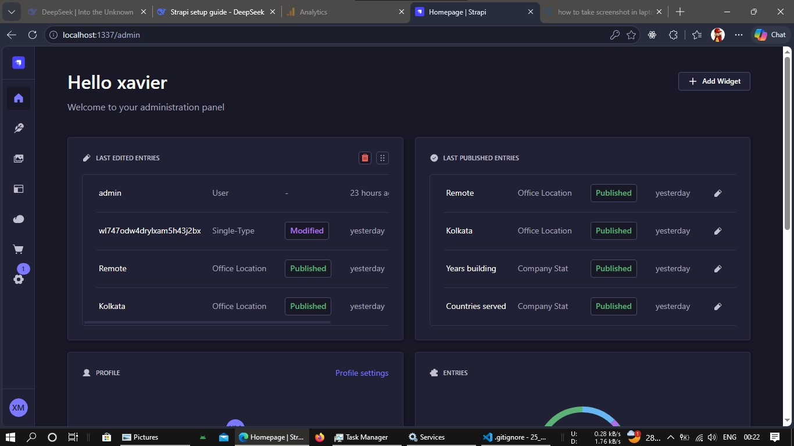
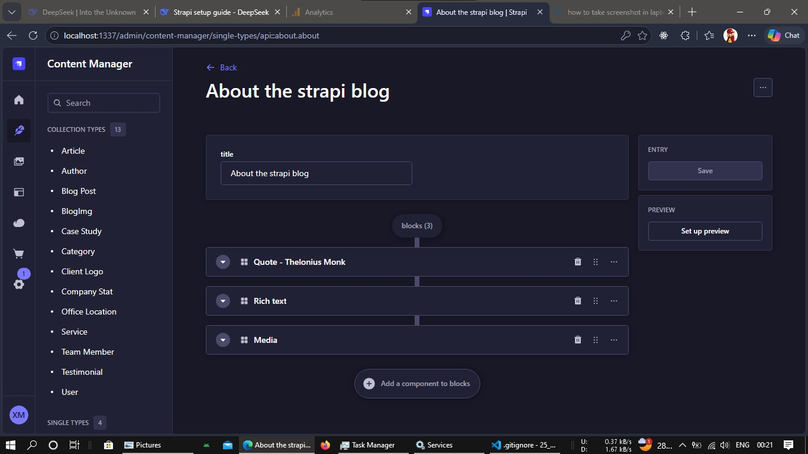
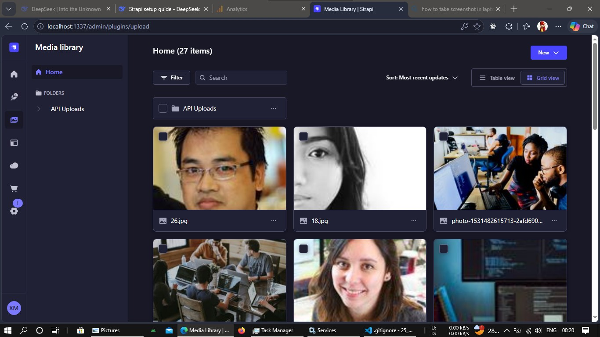

<!-- @format -->

# 🚀 Strapi Backend Project

A powerful, customizable, and headless CMS backend built with [Strapi](https://strapi.io/). This project powers the API layer for our application — managing content, media, and user authentication out of the box.

---

## 📋 Table of Contents

- [Prerequisites](#-prerequisites)
- [Getting Started](#-getting-started)
  - [Step 1: Clone the Repository](#step-1-clone-the-repository)
  - [Step 2: Install Dependencies](#step-2-install-dependencies)
  - [Step 3: Configure Environment Variables](#step-3-configure-environment-variables)
  - [Step 4: Set Up the Database](#step-4-set-up-the-database)
  - [Step 5: Run the Development Server](#step-5-run-the-development-server)
- [Accessing the Admin Panel](#-accessing-the-admin-panel)
- [Project Structure](#-project-structure)
- [Available Scripts](#-available-scripts)
- [Troubleshooting](#-troubleshooting)
- [License](#-license)

---

## ✅ Prerequisites

Before you begin, make sure you have the following installed on your machine:

| Tool     | Version                     | Download                            |
| -------- | --------------------------- | ----------------------------------- |
| Node.js  | v18.x or v20.x              | [nodejs.org](https://nodejs.org/)   |
| npm      | v6+ (comes with Node)       | —                                   |
| Git      | Latest                      | [git-scm.com](https://git-scm.com/) |
| Database | PostgreSQL / MySQL / SQLite | Your choice                         |

> 💡 **Tip:** You can verify your installations by running:
>
> ```bash
> node -v
> npm -v
> git --version
> ```


---

## 🏁 Getting Started

Follow these steps to get your Strapi backend running locally in under 5 minutes.

### Step 1: Clone the Repository

Open your terminal and clone the project:

```bash
git clone https://github.com/your-username/your-strapi-project.git
cd your-strapi-project

Install all required npm packages:


npm install
# 🚀 Getting started with Strapi

Strapi comes with a full featured [Command Line Interface](https://docs.strapi.io/dev-docs/cli) (CLI) which lets you scaffold and manage your project in seconds.

### `develop`

Start your Strapi application with autoReload enabled. [Learn more](https://docs.strapi.io/dev-docs/cli#strapi-develop)

```

npm run develop

# or

yarn develop

```

### `start`

Start your Strapi application with autoReload disabled. [Learn more](https://docs.strapi.io/dev-docs/cli#strapi-start)

```

npm run start

# or

yarn start

```

### `build`

Build your admin panel. [Learn more](https://docs.strapi.io/dev-docs/cli#strapi-build)

```

npm run build

# or

yarn build

```

## ⚙️ Deployment

Strapi gives you many possible deployment options for your project including [Strapi Cloud](https://cloud.strapi.io). Browse the [deployment section of the documentation](https://docs.strapi.io/dev-docs/deployment) to find the best solution for your use case.

```

yarn strapi deploy

```

## 📚 Learn more

- [Resource center](https://strapi.io/resource-center) - Strapi resource center.
- [Strapi documentation](https://docs.strapi.io) - Official Strapi documentation.
- [Strapi tutorials](https://strapi.io/tutorials) - List of tutorials made by the core team and the community.
- [Strapi blog](https://strapi.io/blog) - Official Strapi blog containing articles made by the Strapi team and the community.
- [Changelog](https://strapi.io/changelog) - Find out about the Strapi product updates, new features and general improvements.

Feel free to check out the [Strapi GitHub repository](https://github.com/strapi/strapi). Your feedback and contributions are welcome!

## ✨ Community

- [Discord](https://discord.strapi.io) - Come chat with the Strapi community including the core team.
- [Forum](https://forum.strapi.io/) - Place to discuss, ask questions and find answers, show your Strapi project and get feedback or just talk with other Community members.
- [Awesome Strapi](https://github.com/strapi/awesome-strapi) - A curated list of awesome things related to Strapi.

---

<sub>🤫 Psst! [Strapi is hiring](https://strapi.io/careers).</sub>
```

🔐 Accessing the Admin Panel
Open your browser and visit:

http://localhost:1337/admin

and you see like this





